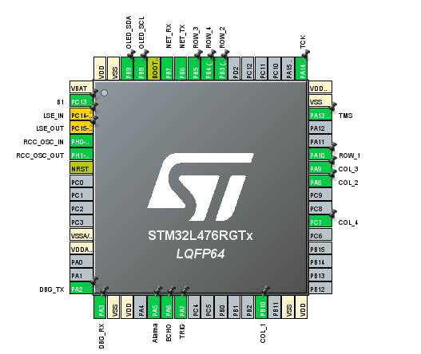

# Security System 
The project consists of a security system based on proximity detection for the activation or deactivation of an alarm.. Please go to the [C4Model](Doc/C4Model.md) diagrams for more details on the functionality of the system.

## Hardware prerequisites
* The example is a digital lock system featuring an STM32L4 for controling the system, an ESP8266 for interfacing with the internet, a keypad for getting the sequences, proximity sensor and an OLED display for GUI. See more details in the [C4Model](Doc/C4Model.md)
* The following is the pinout of the STM32:

## Firmware prerequisites
* The ESP8266 runs the esp-link [v2.2.3](https://github.com/jeelabs/esp-link/releases/tag/v2.2.3) firmware. Please follow the [serial flashing guide](https://github.com/jeelabs/esp-link/blob/master/FLASHING.md#initial-serial-flashing).
* The STM32 runs the firmware compiled from this repository using STM32CubeIDE.

## Building and Flashing
* Open the project in STM32CubeIDE.
* Compile using the current project settings.
* Use an ST-LINK to flash the firmware into the STM32.

## Functionality
* The keypad for logging in and changing the system password.
* The ultrasonic sensor is used for intrusion detection. 
* The internet interface is used to alert the user in case of intruder detection, with the possibility of deactivating the alarm remotely.

## Contact info
* Sergio Andres Cuadrado Fragozo  secuadradof@unal.edu.co
* Juan David Martinez Sanchez  juamartinezs@unaledu.co
